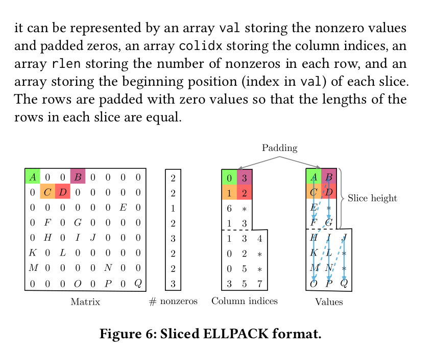
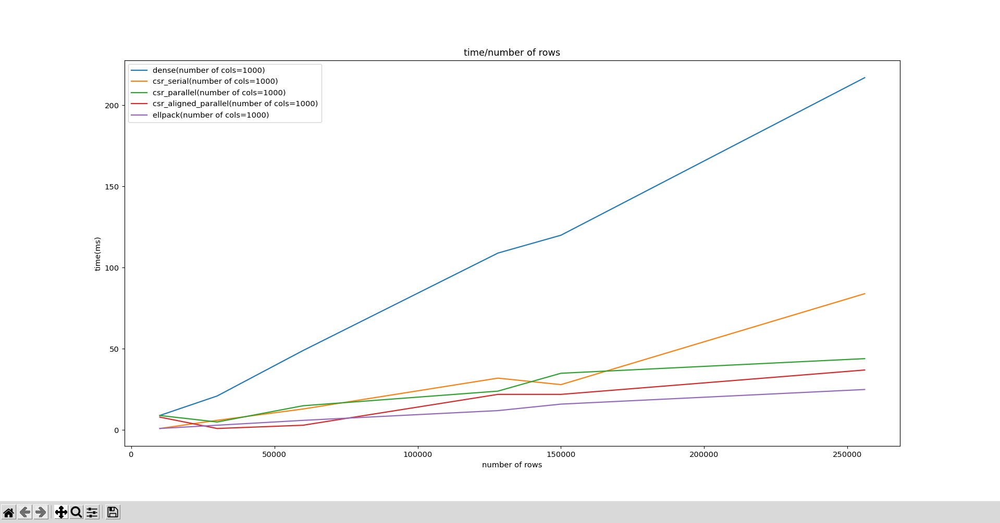
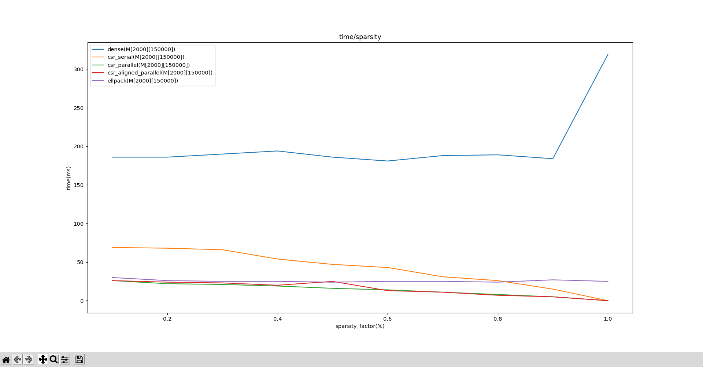

# SpMV

## Methods 

In the following section we would briefly investigate methods used for calculating SpMV

### Naive approach

This method makes no use of the fact that our input matrix is in fact sparse and tries to multiply matrix _M_ to vector _V_
by naively iterating over each cell in matrix.

This implementation can be find in `dense/dense_serial.c` source file.

### CSR
CSR (Compressed Sparse Row) is a well-known data structure used to store sparse matrices

The amount of memory needed for storing a sparse matrix in this format is of `O(nnz+n)` where `nnz` is the 
number of none zero values and n is number of rows in matrix. 

Our CSR format is something like this: 

```C 
typedef struct CSR {
  int *cols;
  int *vals;
  size_t *row_ptrs;

  size_t col_size;
  size_t nnz;
} csr_t;
```
where,
- `col_size` is size of each column which is equal to number of rows.
- `nnz` is number of none zero values in our matrix.
- `vals` is none zero values in our matrix sorted by their row number.
- `cols` is an array of size `nnz` which each index represent column number of their counter part in `vals` array.
- `row_ptrs` is an array containing pointers (indices of `cols` array) indicating row number of each value. as an 
example, all values between `row_ptrs[row_idx]` and `row_ptrs[row_idx+1]` indices in `vals`, have row number of `row_idx`.

This data structure has huge advantage when used for storing sparse matrices since it doesn't store any zero value and could reduce data size 
by orders of magnitude (usually `nnz` is of `O(n)` which means we need `O(n)` memory as oppose to `O(m*n)` in naive implementation).

This decrease in storage size also means that we need to do less computation for SpMV since we only have access to `nnz` values and not the whole matrix

`csr/csr_serial.c` implements a serial implementation of SpMV for matrices stored with `csr_t` data format.
as shown in the source file, after converting matrix to its `csr_t` format, all we have to do is do this simple for loop: 

```C 
  for (size_t i = 0; i < csr->col_size; i++) {
    for (size_t j = csr->row_ptrs[i]; j < csr->row_ptrs[i + 1]; j++) {
      output[i] += vector[csr->cols[j]] * csr->vals[j];
    }
  }
```

`csr/csr_parallel.c` tries to make use of OS threads in order to boost the performance.
Simply using OpenMP directive, we can assign a thread for each row and thus, boost up performance

```C 
#pragma omp parallel for schedule(static) shared(output, vector, csr)
  for (size_t i = 0; i < csr->col_size; i++) {
    for (size_t j = csr->row_ptrs[i]; j < csr->row_ptrs[i + 1]; j++) {
      output[i] += vector[csr->cols[j]] * csr->vals[j];
    }
  }
```

Though fast, there is still room for improvement! 

If we look at the declaration of `output` vector we see the following.
```C 
int output[col_size];
```
In our Implementation, each thread is responsible for doing multiplication of a single row, thus updating its corresponding index
in `output`. 
`output` itself, is a 32bit aligned array which means two threads which are responsible for adjacent rows, would probably be modifying 
data from the same cache line,thus creating _false sharing_ situation.

In order to prevent that from happening, we have to alter `output` such that each member is 64byte aligned
(cache line is 64byte in `x86` based systems). Doing so would allow threads to modify their output without 
creating _false sharing_ and results a boost in performance.

`csr/csr_aligned_parallel.c` would solve this problem by defining `data_t`, a 64 byte aligned data structure and then defining 
`output` array as an array of `data_t` elements as oppose to 32bit aligned `int`.

```C 
typedef struct cache_optimized_int {
  int __attribute__((aligned(64))) data;
} data_t;
```

### SIMD
The last attempt was to make use of underlying SIMD hardware instead of threads.
Unfortunately, our csr data format is not suited for this task since it has lots of indirection and _reduce_ operations that aren't 
really a thing for SIMD hardware, specially vector processors.

Using methods recommended in [this article](https://caidao22.github.io/publication/zhang-2018/ICPP_KNL_final.pdf) we implement a data type 
called `ellpack_t`

```C++
typedef struct EllpackSlice {
  int cap;
  input_t *vals;
  addr_t *cols;
  vector<int> pack_ptr;
  vector<pair<int, addr_t>> rows;
} ellpack_t;
```

The ellpack data structure make use of the underlying vector processor hardware by splitting rows into packs of size `PACK_SIZE` where `PACK_SIZE` is the number of elements in the vector, and then calculate SpMV by using vector processor instructions for each pack

```C++ 
const short AVX256_VLEN = 256;

const short PACK_SIZE = AVX256_VLEN / (8 * sizeof(input_t));
```
since the mentioned article explains _ELLPACK SLICE_ data format in great detail, we only briefly cover _ELLPACK SLICE_ here.

For each pack, we iterate over the rows and store a `nnz` value from each row. we keep doing so until there is no `nnz` left in this pack.
Illustration below would better explain ellpack



Note that in ellpack implementation we might endup storing some zeros in our data format.

Another thing worth noticing is that the order of rows greatly affects the overall performance; since it has direct effect on number
of extra zero and hence, number of extra instructions we use. In this article, the Author chose to not change the ordering of the rows 
since the implementation was targeted to be a used as library and author thought it's the user's responsibility to reorder rows, not library. 
But in our use case, we used simple sort based on `nnz` of each row to reduce excess data. Though its not always the best answer, it's so close 
to perfection and suitable for our use case.


Now that we have our matrix stored in mentioned format, calculating SpMV using SIMD (here, using `avx2` library) would be something like this:

```C++ 
for (addr_t pck_idx = 0; pck_idx < ellpack.pack_ptr.size() - 1; pck_idx++) {
  for (addr_t pck_ofs = ellpack.pack_ptr[pck_idx];
       pck_ofs < ellpack.pack_ptr[pck_idx + 1]; pck_ofs += PACK_SIZE) {
    addr_t row_ofs = pck_idx * PACK_SIZE;

    __m256i m256_idx =
        _mm256_load_si256((__m256i const *)(ellpack.cols + pck_ofs));
    __m256 m256_val = _mm256_load_ps((ellpack.vals + pck_ofs));
    __m256 m256_prv = _mm256_load_ps((res + row_ofs));
    __m256 m256_vec = _mm256_i32gather_ps(vec, m256_idx, 4);

    /* sadly my system didn't have support for `mm_fmadd` which was
     * introduced in avx512vl
     */
    __m256 m256_mul = _mm256_mul_ps(m256_vec, m256_val);
    __m256 m256_out = _mm256_add_ps(m256_mul, m256_prv);

    /* sadly my system didn't have support for `mm_i32scatter` which was
     * introduced in avx512vl
     * so we just directly load to an intermediate array and then do
     * the scatter by hand
     */
    _mm256_store_ps((res + row_ofs), m256_out);
  }
}
```

## Benchmakrs
inorder to test the performance of our implementations, we used two separate benchmark, one for different number of rows and one for different levels of sparsity.

### Different number of rows


As shown above, we gain quite a huge performance boost when just switching to _CSR_ format because of the decrease in amount of calculations we have to do.

As expected, using threads also enhances the performance quite noticeably. Also optimizing cache usage used in `csr_aligned_parallel` results in 
lower memory IO and better results.

As for _ELLPACK_ implementation using vector processors, the results is a little bit tricky. Based on the hardware spec one might endup with different results.
For this particular bench mark, a CPU with `6` cores was used; so the parallelism level in thread based implementations is 6; 
whereas _ELLPACK_ implementation using _SIMD_, the CPU had support for `avx2` architecture which means our vectors are of length `8`, 
meaning we have better level of parallelism/concurrency for _SIMD_ implementation than _thread based_ implementation.
Changing any of the configurations above would greatly affect the overall performance. 
For example, using a CPU that has support for `avx512vl` architecture for longer vectors and 
using its new instructions such as `__mm512_fmadd` and `__mm512_scatter`  would result in better performance. 
On the other hand, simply using a CPU with more cores, would increase the level of parallelism in our implementation for `csr_parallel` and `csr_aligned_parallel`. 

### Different level of sparsity 


As we can see, the sparser the matrix get, the better performance we gain from _CSR_ format since the amount of instruction we execute 
has direct relation with amount of none zero value our matrix has. If we take a good look at the chart, we could see that when  _sparsity factor_ gets close to one,
the runtime for serial implementation of _CSR_ gets close to that of parallel implementations indicating that context switch overhead for parallel imlementations 
is actually the bottleneck resulting the same performance as the serial implementation.
As for _ELLPACK_ implementation, given the algorithm we used, _sparsity factor_ cease to affect data size and thus, we see no huge shift in runtime as we pass a critical point.

## Future works 
- The _SIMD_ implementation used `_mm256` instruction set provided by `avx2` library. As good as they are, they still lack perfection. 
Limitations with this library are: 
  * Short vector length (only 256 bit of data)
  * Though has support for instructions such as `_mm256_gather`, there is no support for _scatter_ functions (if you look at the code, scatter was implemented by hand!)
  * No support for _fuse mull add_ which increases the performance by doing two instructions in one.

All mentioned problems have been solved in more resent architectures like `avx512vl`. That is: 
  * It has support for vectors of length `512`
  * The `_mm_scatter` family of instructions was added.
  * Added support for `_mm_fmadd` which does the _fuse mull add_ operation.

Unfortunately my system wasn't so up to date and i gone with `avx2` library, so you could go with `avx512vl` library should you have a CPU which has support for it.

- All the tests and benchmarks are taken over a relatively small test cases (the largest matrix was of size `256000`*`1000`) and one may argue that the test results 
are noisy and not reliable. So a step forward would be to use bigger test cases.

- The _random matrix generator_ is so naively implemented and takes huge amount of runtime that isn't even important for us. 
So even though we only measure the runtime for the _SpMV_ functions,we have to wait for quite a lot for tests to finish (As an example, it takes about 3 seconds 
for matrix to be generated, as for the _SpMV_ function, it only takes about 250 milliseconds at worst case.)


